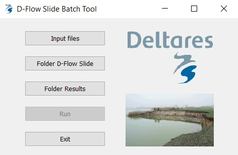
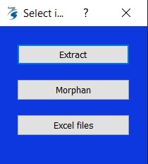
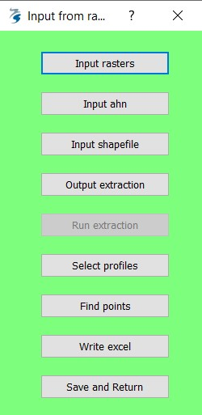
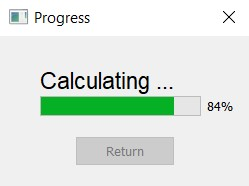

Provisional repository for manual and developments of D+Flow Slide batch tool

# D-Flow Slide Batch tool

Batch Tool Interface for D-Flow Slides. The interface also takes care of input preparation and generation for D-Flow Slide computation.

*D-Flow Slide - background [here](https://publicwiki.deltares.nl/display/GEO/Background+-+Detailed+check)* 

*Batch tool repository [here](https://repos.deltares.nl/repos/DFS)* 

---

## Interface
The interface main window shows the general options the user can select. With `Input files` the user can select the input file to be ingested in D-Flow Slide. The button `Folder D-Flow Slide` let the user select the folder where the kernel of D-Flow Slide is in. The computation will make use of the libraries and executables contained in that folder. With `Folder Results`, the user selects the output folder for the run. Once the information from these three buttons is gathered, the `Run` button will activate and run D-Flow Slide. The user can either start another run with other input values or exit the interface by pressing `Exit`. Keep in mind that a log of the computation is shown in the terminal, so that the user always knows what is happening under the hood. 

---

Pressing `Input Files` let the user decide whether the input is simply selected or it is generated. The choice is presented between three different ways of generating the excel input files for D-Flow Slide run. If input excel files are already in place, select the button `Excel files`. This opens a window for direct selection of the input folder. The other two options allow for the generation of the input. With the first button `Extract` the user can generate the input files from a shapefile containing transects and a number of rasters of bathymetry and topography. The button `Morphan` let the user generate input files directly from Morphan output files. The latter workflow is still *in progress*. 

---

Pressing `Extract` opens a menu for the extraction of input files from bathymetry/topography and shapefile. The user select the location of .tif bathymetric files by clicking on `Input rasters`. The location of topographic files is given by clicking on `Input ahn`. A shapefile containing cross-shore transects is selected with `Input shapefile`. The shapefile can contain one or multiple shapefiles. The button `Output extraction` let the user select the location of the output of this raster extraction analysis. Once the above mentioned options are determined, the button `Run extraction` will execute the extraction code. This may take a minute, however the output from terminal shows the running tasks. The next operations aim at finding characteristic points and writing the excel file to use as input of D-Flow Slide. Once the profiles have been extracted from rasters, next time the user opens the interface, the user can directly start from these last remaining steps, so that the extraction does not have to take place every time the interface is opened. Click on `Select profiles` to select just a number of profiles from the ones extracted in the previous steps. Click `Find points` to find characteristic points from the selected profiles. The windows that pop-up will also ask for a kering shapefile to easily determine the side of the river/channel to calculate the characteristic points from. This may take a minute, so wait for the bar to finish and follow the operations from the terminal. The button `Write excel` writes excel in a folder the user chooses. `Save and Return` will return to the main interface window. 

NB: All the windows that pop-up have a title explaining what the user should do. This helps a lot to direct actions throughout the process.

---

## Getting started
Open a terminal and run DFlowSlide_Batch.exe. After clicking on the executable, wait a few minutes for the application to start. Once started, press `Input Files`.

### Requirements
Running the D-Flow Slide Batch tool needs:
* raster ('tif') bathymetric file or files;
* raster ('tif') topographic file or files;
* cross river transects ('shp') along which we interpolate the rasters and obtain the profiles;
* barrier line ('shp') shapefile of a line which represents the keringlijn, to help determining what side is the profile to be tested and hence the transect/profile direction.

### Run on existing input files
In case the user has already available input excel files, they can be selected click on and `Excel files`. After folder selection, the user can continue from the main screen and follow the instructions in paragraph 'Run DFlowSlide batch tool'. 

### Extract profiles from raster
Press on `Extract` to extract profiles from rasters, and find characteristic points and write excel input files for DFlow-Slide. Once the user clicks on `Extract`, a menu window opens for the extraction of input files from bathymetry/topography and shapefile. The user selects the location of .tif bathymetric files by clicking on `Input rasters`; double-clicking on the folder containing all rasters and then pressing `Select Folder` will select all rasters contained in that folder. The location of the topographic file is given by clicking on `Input ahn`; clicking on the ahn .tif file and then pressing `Open` will select the topographic file. A shapefile containing cross-shore transects is selected with `Input shapefile`; to select the cross-shore profiles, click on the .shp file and then select `Open`. The button `Output extraction` let the user select the location of the output of this raster extraction analysis. You may create a new folder, or select directly an existing one. Just be aware that folders and files with the same name will be overwritten. Once the above mentioned options are determined, the button `Run extraction` will execute the extraction code. This may take a minute, however the output from terminal shows the running tasks. When plots generation is over, the user can go through the next steps.

NB. If the extraction of raster has been already carried out, there is no need to follow the entire procedure from the beginning. In fact, once the rasters are interpolated along the cross transects, profiles are obtained and saved in the "raw" folder. At this point, the characteristic points and the DFlowSlide excel input files can be obtained, without processing any raster. So the user will just have to `Select shapefile`, then click on `Select profiles` and follow the remaining steps thereafter. 

### Find characteristic points and generate input file for DFlowSlide
Once the raster extraction is done (i.e. when all plots have been generated), the next commands can be executed. The next operations aim at finding characteristic points and writing the excel file to use as input of D-Flow Slide. Once the profiles are extracted from rasters, the profiles are saved on "raw" folder. Therefore next time the user opens the interface, the user can directly select a shapefile with `Select shapefile` and start from these last remaining steps, so that the extraction does not have to take place every time the interface is opened. 

To find characteristic points, click on `Select profiles` to select just a number of profiles from the ones extracted in the previous steps. The user has to point to the folder of cross profiles inside the 'raw' folder created in the previous steps; This folder will have the same name as the shapefile. This step let you also choose a number of transects from the interface. Click `Find points` to find characteristic points from the selected transects. The windows that pop-up will also ask to select the .shp file of the kering (barrier line) to easily determine the side of the river/channel to calculate the characteristic points from. This may take a minute, so wait and follow the operations from the terminal. When you read "Characteristic points computed", you can go to the next step. The button `Write excel` writes excel in a folder the user chooses. Once clicked, inside the 'processed' folder, select the folder with the foldername as the shapefile name. After that, select the input for DFlow Slide, i.e. the place where you want to save your input file for the next phase, and wait until the Excel files are written. Again, you may create a new folder, or select directly an existing one. `Save and Return` will return to the main interface window. 

### Run DFlowSlide batch tool
Once the excels files are written, click on `Save and Return` to come back to the main screen. Input files are already stored in memory, so there is no need to click on `Input files` again, unless the user would like to process other input files. The button `Folder D-Flow Slide` let the user select the folder where the kernel of D-Flow Slide is in. The computation will make use of the libraries and executables contained in that folder. With `Folder Results`, the user selects the output folder for the run. The user can now finally run DFlow Slide computation by clicking on `Run` button. The following progress bar will appear. Process may take a few minutes to end and results will be saved in the folder selected previously via `Folder Results`. 
 

### Extract profiles from Morphan
In progress.

---

## Prerequisites

Anaconda3 and python 3.7 is used through the development of the input generation for the batch tool. Code is also available [here](https://repos.deltares.nl/repos/DFS/).
The stand-alone configuration of the batch tool let the user avoid the set-up of an environment or an environment.yml file, 

---

## Authors
* **Giorgio Santinelli**
* **Maria Luisa Taccari**
* **Bruno Zuada Coelho**

