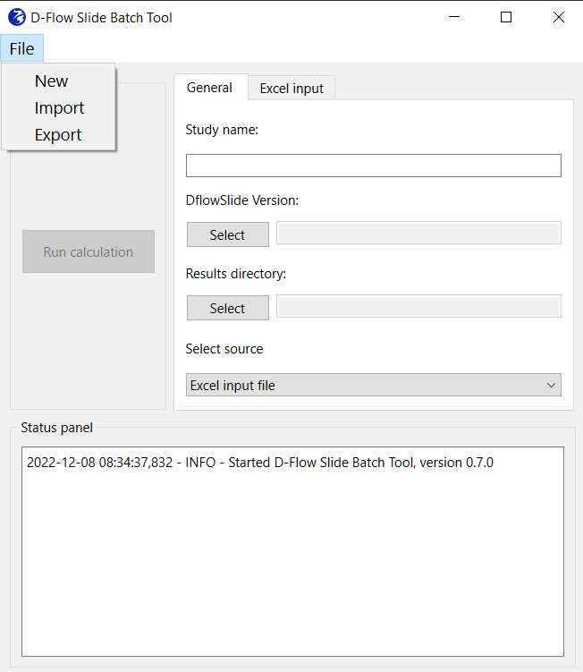

# DFlowSlide Batch Tool manual
The Batch Tool DFlowSlides has undergone many changes in the last 3 years. In 2022, the code has been refactored and cleaned to enable easier development, improve modularity, deployment, and user-readability. The Batch Tool consists of an interface that takes care of the input reading and pre-processing, and the running for DFlowSlide computations.

A little background on D-FlowSlide is available from the wiki-page:
*D-Flow Slide - background [here](https://publicwiki.deltares.nl/display/GEO/Background+-+Detailed+check)* 

The repository is on Github. It may still be a private repository. If not, content would be available.
*Batch tool repository [here](https://github.com/Deltares/DFlowSlide_batchtool)* 

---

## Getting started
The tool can work on Windows platforms, and it is an executable called `D-FlowSlide_Batchtool.exe`. After clicking on the executable, wait a half a minute for the application to start. Once started, the application will look like the following.

### Requirements
Running the D-Flow Slide Batch tool needs:
* raster ('tif') bathymetric file or files;
* raster ('tif') topographic file or files;
* cross river transects ('shp') along which we interpolate the rasters and obtain the profiles;
* barrier line ('shp') shapefile of a line which represents the keringlijn, to help determining what side is the profile to be tested and hence the transect/profile direction.

### Technical Requirements
Requirements and environment file for local installation and testing are maintained on a private repository [here](https://github.com/Deltares/DFlowSlide_batchtool).
The stand-alone configuration (.exe) of the batch tool has the advantage of being built with modern development CI/CD workflows, with unit and acceptance testing, and ultimately to keep the user free from local building from code. 

---

## Process directly excel files

The interface main window shows the general options the user can select. `Select Source` cascading menu let you choose between running D-Flow Slide calculation with the processed .xls input files of D-Flow Slide. By the `DFlowSlide Version` selection the user select the binary folder where the kernel of D-Flow Slide is in. The computation will make use of the libraries and executables contained in that folder. With `Results directory` selection, the user selects the output folder for the D-Flow Slide run. Once the information from these three buttons is gathered, the `Run` button will activate and run D-Flow Slide. The user can either start another run with other input values or exit the interface by pressing `Exit`. Keep in mind that a log of the computation is shown in the terminal, so that the user always knows what is happening under the hood. 

---

---

### Run on existing input files
In case the user has already available input excel files, they can be selected click on and `Excel files`. After folder selection, the user can continue from the main screen and follow the instructions in paragraph 'Run DFlowSlide batch tool'. 

### Extract profiles from raster
Press on `Extract` to extract profiles from rasters, and find characteristic points and write excel input files for DFlow-Slide. Once the user clicks on `Extract`, a menu window opens for the extraction of input files from bathymetry/topography and shapefile. The user selects the location of .tif bathymetric files by clicking on `Input rasters`; double-clicking on the folder containing all rasters and then pressing `Select Folder` will select all rasters contained in that folder. The location of the topographic file is given by clicking on `Input ahn`; clicking on the ahn .tif file and then pressing `Open` will select the topographic file. A shapefile containing cross-shore transects is selected with `Input shapefile`; to select the cross-shore profiles, click on the .shp file and then select `Open`. The button `Output extraction` let the user select the location of the output of this raster extraction analysis. You may create a new folder, or select directly an existing one. Just be aware that folders and files with the same name will be overwritten. Once the above mentioned options are determined, the button `Run extraction` will execute the extraction code. This may take a minute, however the output from terminal shows the running tasks. When plots generation is over, the user can go through the next steps.

NB. If the extraction of raster has been already carried out, there is no need to follow the entire procedure from the beginning. In fact, once the rasters are interpolated along the cross transects, profiles are obtained and saved in the "raw" folder. At this point, the characteristic points and the DFlowSlide excel input files can be obtained, without processing any raster. So the user will just have to `Select shapefile`, then click on `Select profiles` and follow the remaining steps thereafter. 

### Find characteristic points and generate input file for DFlowSlide
Once the raster extraction is done (i.e. when all plots have been generated), the next commands can be executed. The next operations aim at finding characteristic points and writing the excel file to use as input of D-Flow Slide. Once the profiles are extracted from rasters, the profiles are saved on "raw" folder. Therefore next time the user opens the interface, the user can directly select a shapefile with `Select shapefile` and start from these last remaining steps, so that the extraction does not have to take place every time the interface is opened. 

To find characteristic points, click on `Select profiles` to select just a number of profiles from the ones extracted in the previous steps. The user has to point to the folder of cross profiles inside the 'raw' folder created in the previous steps; This folder will have the same name as the shapefile. This step let you also choose a number of transects from the interface. Click `Find points` to find characteristic points from the selected transects. The windows that pop-up will also ask to select the .shp file of the kering (barrier line) to easily determine the side of the river/channel to calculate the characteristic points from. This may take a minute, so wait and follow the operations from the terminal. When you read "Characteristic points computed", you can go to the next step. The button `Write excel` writes excel in a folder the user chooses. Once clicked, inside the 'processed' folder, select the folder with the foldername as the shapefile name. After that, select the input for DFlow Slide, i.e. the place where you want to save your input file for the next phase, and wait until the Excel files are written. Again, you may create a new folder, or select directly an existing one. `Save and Return` will return to the main interface window. 

### Run DFlowSlide batch tool
Once the excels files are written, click on `Save and Return` to come back to the main screen. Input files are already stored in memory, so there is no need to click on `Input files` again, unless the user would like to process other input files. The button `Folder D-Flow Slide` let the user select the folder where the kernel of D-Flow Slide is in. The computation will make use of the libraries and executables contained in that folder. With `Folder Results`, the user selects the output folder for the run. The user can now finally run DFlow Slide computation by clicking on `Run` button. The following progress bar will appear. Process may take a few minutes to end and results will be saved in the folder selected previously via `Folder Results`. 
 

--- 

## Other options of usage

### Import and export .dbt files
By clicking on `File` from cascading menu, three options open that interact with a settings .json file with `.dbt` extension. The three options let you: 
* New: Swip out all changes, and start with a new clean interface;
* Export: This will create a new `.dbt` file with as name the `Study name` given in the `General` tab. 
* Import: If you already have a previously exported `.dbt` file, you can simply import it here. Doing so will automatically fill in the fields from the interface. 

### Rerun the tool with different files
If you would like to keep the same settings but just need changing files, it is advised to import a previously exported `.dbt` file and just import the path of those new files from the interface. This tip is valid for any setting you may want to change.

### Re-run auto detection as manual
If after the auto detection the user is not satisfied, importing the `.dbt` file will help to restore all settings and just find points in a manual way.

---

## Description of the tool tabs and buttons

The tool consists of an `Action` panel with buttons, a tabs panel for selection of input, and a `Status Panel` with logging showing the status of the selection and calculation. 
The `General` tab let the user decide whether the input is simply selected or it is generated. If Excel option is chosen, the tab `Excel input` guids the user in the selection of the input files, and the `Run calculation` button is activated. The `Extract files` option allow for the generation of the input for D-Flow Slide. By selecting it as source, new tabs and buttons are generated in the interface so the user can generate the input files for D-Flow Slide from a shapefile containing transects and a number of rasters of bathymetry and topography. 
When running with `Extract files` mode, the `General` tab does not change. The tabs `Extract data`, `Select Transects`, `Characteristic Points` and the new buttons `Run extraction`, `Find Points`, `Export to .xlsx` appear. `Raster Folder` asks for a folder with raster files, namely bathymetric surveys. `AHN File` asks for a single topographic file for integration of the surveys. A shapefile containing cross-shore transects is selected with `Cross-section (*.shp)`. The shapefile can contain one or multiple shapefiles. The field `Extraction output folder` let the user select the location of the output of this raster extraction analysis. Now the button `Run extraction` is enabled. The following tab `Select transects` let you select the transect once the `Run extraction` analysis is complete. Alternatively, you can still select the folder where transects previously computed are stored. The tab `Characteristic Points` let the user select an along-section kering shapefile and select the calculation mode from the  `Calculation mode` menu. Once all fields  are complete, the two buttons `Find points` and `Export to .xlsx` perform finding characteristic points and writing the excel file to use as input of D-Flow Slide, respectively. `Run calculation` can be run to let D-Flow Slide compute on the input files and the settings given.

NB: All the windows that pop-up have a title explaining what the user should do. This helps to direct actions throughout the process.

---

### Further developments
Pending development actions to the tool are not available at the moment and comprise:
- Insert multiple soil layers
- Better definition of top revetment and bottom revetment
- Choosing auto / manual selection of characteristic points after each profile
- Extracting profiles from Morphan
- Rebuild as a browser application

---

---

## Authors
* **Giorgio Santinelli**
* **Carles Soriano Perez**
* **Maria Luisa Taccari**
* **Bruno Zuada Coelho**

