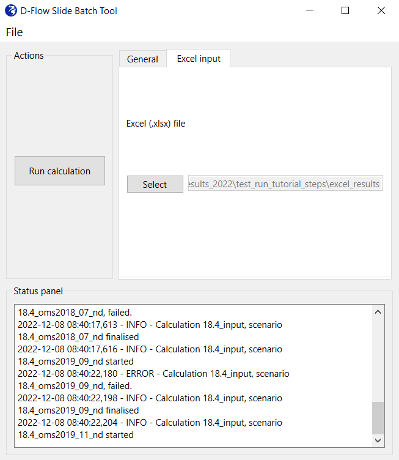

# DFlowSlide Batch Tool manual
The Batch Tool DFlowSlides has undergone many changes in the last 3 years. In 2022, the code has been refactored and cleaned to enable easier development, improve modularity, deployment, and user-readability. The Batch Tool consists of an interface that takes care of the input reading and pre-processing, and the running for DFlowSlide computations.

A little background on D-FlowSlide is available from the wiki-page:
*D-Flow Slide - background [here](https://publicwiki.deltares.nl/display/GEO/Background+-+Detailed+check)* 

The repository is on Github. It may still be a private repository. If not, content would be available.
*Batch tool repository [here](https://github.com/Deltares/DFlowSlide_batchtool)* 

---

## Getting started
The tool can work on Windows platforms, and it is an executable called `D-FlowSlide_Batchtool.exe`. After clicking on the executable, wait a half a minute for the application to start. Once started, the application will look like the following.

### Requirements
Running the D-Flow Slide Batch tool needs:
* raster ('tif') bathymetric file or files;
* raster ('tif') topographic file or files;
* cross river transects ('shp') along which we interpolate the rasters and obtain the profiles;
* barrier line ('shp') shapefile of a line which represents the keringlijn, to help determining what side is the profile to be tested and hence the transect/profile direction.

### Technical Requirements
Requirements and environment file for local installation and testing are maintained on a private repository [here](https://github.com/Deltares/DFlowSlide_batchtool).
The stand-alone configuration (.exe) of the batch tool has the advantage of being built with modern development CI/CD workflows, with unit and acceptance testing, and ultimately to keep the user free from local building from code. 

---
## Intro
The interface main window shows the general options the user can select. `Select Source` cascading menu let you choose between running D-Flow Slide calculation with the processed .xls input files of D-Flow Slide, or generate those input files through a process of extraction of transects and characteristic points detection. These two options are selected in the `Select Source` menu and point to `Excel files` and `Extract files` respectively. These options will be discussed in the following two sections.

### Run D-Flow Slide with input excel files
Once the `Select Source` option is on `Excel files` the user can proceed with filling in the other fields. By the `DFlowSlide Version` selection the user select the binary folder where the kernel of D-Flow Slide is in. The computation will make use of the libraries and executables contained in that folder. If the user has already processed .xls input files of D-Flow Slide, with `Results directory` selection, the user selects the output folder for the D-Flow Slide run. Once the information from these fields are filled in, the `Run calculation` button will activate and run D-Flow Slide. The user can either start another run with other input values or exit the interface by closing the tool. 

### Extract files, find points and run D-Flow Slide
Once the `Select Source` option is on `Extract files` the user is ready to fill in all fields for extraction of profiles from rasters, finding characteristic points and writing excel input files for DFlow-Slide. The `Extract data` tab shows the fields. Once they are all there, the `Run extraction` button is activated, and can be started to start the extraction. Once the data is all extracted, the `Select transects` tab let the user select the proper transects from the extraction folder, which is inside the `raw` folder. At this point the `Characteristic Points` tab can be opened. There the `kering shapefile` field should be inserted. If done properly, the  `Find Points` button should be activated. If the `calculation mode` is selected as `Auto`, then finding the points will happen in an automated way. If the mode is `Manual` the plots per profile will be open and the user will go through each of those plots  and follow the instructions given in the image. When you read "Characteristic points computed" in the logging, you can go to the next step. The button `Export to .xlsx` writes the input excels for D-Flow Slide. After that, the `Run calculation` button will activate and by clicking it D-Flow Slide will run. 
 

--- 

## Other options of usage
### Import and export .dbt files
By clicking on `File` from cascading menu, three options open that interact with a settings .json file with `.dbt` extension. The three options let you: 
* New: Swip out all changes, and start with a new clean interface;
* Export: This will create a new `.dbt` file to which a name can be given; 
* Import: If you already have a previously exported `.dbt` file, you can simply import it here. Doing so will automatically fill in the fields from the interface. 

### Rerun the tool with different files
If you would like to keep the same settings but just need changing files, it is advised to import a previously exported `.dbt` file and just import the path of those new files from the interface. This tip is valid for any setting you may want to change.

### Re-run auto detection as manual
If after the auto detection the user is not satisfied, importing the `.dbt` file will help to restore all settings and just find points in a manual way.

---

## Description of the tool tabs and buttons

The tool consists of an `Action` panel with buttons, a tabs panel for selection of input, and a `Status Panel` with logging showing the status of the selection and calculation. 
The `General` tab let the user decide whether the input is simply selected or it is generated. If Excel option is chosen, the tab `Excel input` guides the user in the selection of the input files, and the `Run calculation` button is activated. The `Extract files` option allow for the generation of the input for D-Flow Slide. By selecting it as source, new tabs and buttons are generated in the interface so the user can generate the input files for D-Flow Slide from a shapefile containing transects and a number of rasters of bathymetry and topography. 
When running with `Extract files` mode, the `General` tab does not change. The tabs `Extract data`, `Select Transects`, `Characteristic Points` and the new buttons `Run extraction`, `Find Points`, `Export to .xlsx` appear. `Raster Folder` asks for a folder with raster files, namely bathymetric surveys. `AHN File` asks for a single topographic file for integration of the surveys. A shapefile containing cross-shore transects is selected with `Cross-section (*.shp)`. The shapefile can contain one or multiple shapefiles. The field `Extraction output folder` let the user select the location of the output of this raster extraction analysis. Now the button `Run extraction` is enabled. The following tab `Select transects` let you select the transect once the `Run extraction` analysis is complete. Alternatively, you can still select the folder where transects previously computed are stored. The tab `Characteristic Points` let the user select an along-section kering shapefile and select the calculation mode from the  `Calculation mode` menu. Once all fields  are complete, the two buttons `Find points` and `Export to .xlsx` perform finding characteristic points and writing the excel file to use as input of D-Flow Slide, respectively. `Run calculation` can be run to let D-Flow Slide compute on the input files and the settings given.

NB: All the windows that pop-up have a title explaining what the user should do. This helps to direct actions throughout the process.

---

### Further developments
Pending development actions to the tool are not available at the moment and comprise:
- Insert multiple soil layers
- Better definition of top revetment and bottom revetment
- Choosing auto / manual selection of characteristic points after each profile
- Extracting profiles from Morphan
- Rebuild as a browser application

---

---

## Authors
* **Giorgio Santinelli**
* **Carles Soriano Perez**
* **Maria Luisa Taccari**
* **Bruno Zuada Coelho**

